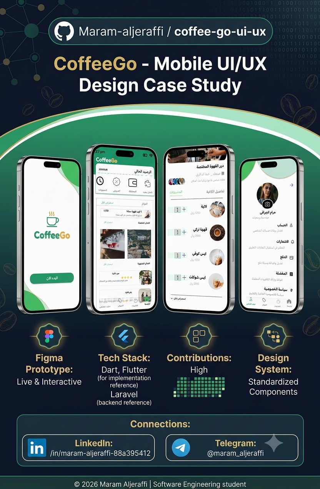

# ☕ Coffee Go - Mobile UI/UX Design Case Study

An intuitive and modern mobile application UI/UX design for a coffee ordering system. Designed with seamless user flows, interactive prototypes, and vibrant visual hierarchy.

---

### 🎨 Live Interactive Prototype
You can view and interact with the full live prototype directly on Figma:  
👉 **[View Coffee Go Figma Design](https://www.figma.com/design/Z3QUXX3KQkfUI59NIoz3td/CoffeeGo?node-id=2-8&m=dev&t=Eozu5g2x9Uby9VaP-1)**

---

### 📱 Key Features & User Flows
- **Smooth Onboarding:** Engaging splash and onboarding screens to welcome users.
- **Dynamic Home:** Quick access to balance, loyalty rewards, and nearby coffee shops.
- **Detailed Menu:** Easy exploration of coffee types with customization options.
- **Offers & Rewards:** Loyalty point tracking (e.g., "1 free cup") and special discounts.
- **Simple Checkout:** Clear order summary and seamless payment flow.

---

### 🛠️ Tools & Design System
- **Design Tool:** Figma
- **Design Pattern:** Clean Visual Hierarchy, Card-based Layouts, Micro-interactions.
- **Design Elements:** Consistent icon family, tailored typography, vibrant and modern color palette.

---

📫 **Connect with me:**

